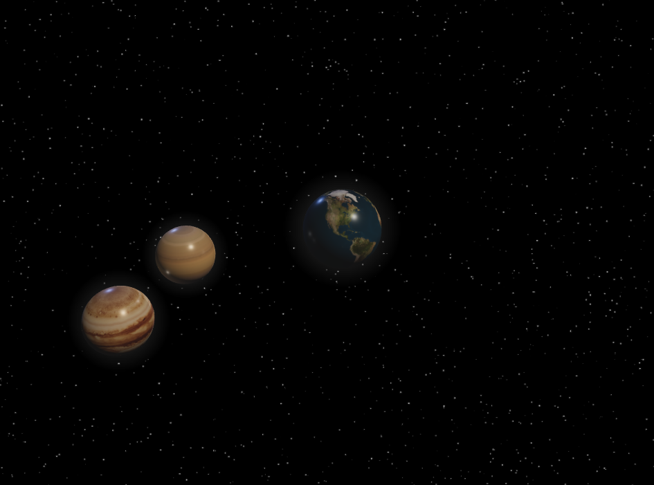

# The Three Body Problem

A 3D simulation of the three body problem using Three.js

A real-time visualization of the three-body problem, built entirely with Three.js and plain JavaScript.  
The simulation uses simple Newtonian gravity and a leapfrog integrator to compute the motion of three bodies influencing each other in 3D space.

Each body features:
- Customizable **mass** , **position**, and **velocity**  
- Realistic **lighting**, **glow**, and **trail effects**  
- Optional **texture maps** (Earth, Jupiter, Saturn)

The scene includes a procedurally generated **starfield background**, interactive **OrbitControls**, and smooth rendering with tone mapping and reflections.
<blockquote>
  #About : 
  The three-body problem is a classic physics system with no closed-form solution, known for its chaotic and unpredictable motion.
  This simulation demonstrates that complexity using simple physics and visualization / no physics engine or WebGL boilerplate involved.
</blockquote>

  

